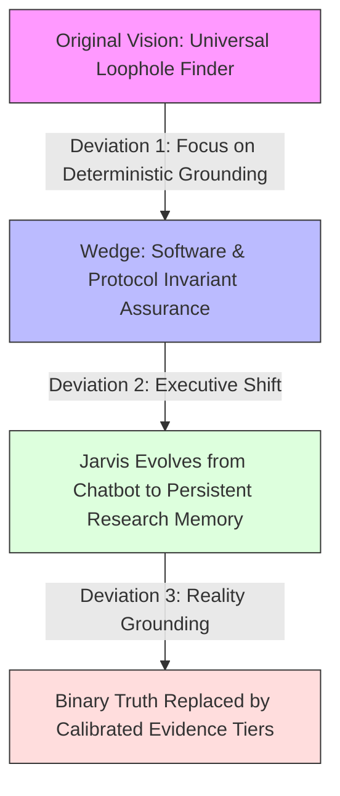

# Personal Tool Ecosystem & Jarvis Architecture — Brainstorm Log

> **Session Date:** 2026-09-10 (Updated: 2026-09-13)  
> **Repository:** `F:\Aaradhya-Dev-Tamrakar\brainstorm`  
> **Scope:** Interconnecting actual tools across `F:\AaradhyaDT`, `F:\Aaradhya-Dev-Tamrakar`, and `F:\FuseAIF2026` into a unified modular ecosystem / personal Jarvis.

---

## 1. Executive Summary & The Core Breakthrough

### The Initial Question
> *"I want to create something that can connect every tool I make... actual tools only, and just a brainstorm for now."*

Historically, projects were built as isolated, highly capable islands:
- A C# .NET 10 desktop app for Windows NT kernel memory management.
- An ESP32-S3 wearable and gateway pipeline for clinical fall detection.
- A Python/Fusion 360 add-in for conversational CAD via MCP.
- A multi-account Google NotebookLM aggregator.
- An Android super-app in Jetpack Compose.
- A project-centric AI workspace and multi-model multiplexer.
- Speed readers, format converters, and autonomous worker fleets.

### The Paradigm Shift: From Apps to Autonomous Capability Modules
> *"I am thinking every project from a module-like viewpoint of whatever the end result may be as a whole integration. Solving niche problems locally, cloud, or hybrid, while also being able to define and create new methods and workflows into existence due to the variable modules."*

This is the **Unix Philosophy elevated to the AI, OS, and IoT era**:
- Individual tools are **Lego blocks (Capability Nodes)**.
- Each node solves a niche problem across **Local, Cloud, or Hybrid** environments.
- Standardized interfaces between modules enable the **dynamic synthesis of emergent workflows** that no single tool could achieve alone.

### The Ultimate Conceptual Model: Jarvis as the Cognitive Interface (Not Just a Chatbot)
A traditional chatbot is a "brain in a jar"—it only responds with passive text.
In this architecture, **"Jarvis" is not a single product or monolithic app; it is the natural-language cognitive and executive interface**:
* **Intelligent Listener & Reasoner:** Listens in natural language, resolves ambiguity, decomposes high-level intent, and explains execution results.
* **Executive Decoupling:** Jarvis doesn't need to implement every task natively. It knows how to compose and orchestrate the underlying **Capability Mesh** to accomplish goals.
* **The Cognitive Triad:**
  1. **Sensory Organs:** Browser DOM (Screen Q&A), video/media (yt-dlp-live), edge kinematics (SPARK), and hardware telemetry.
  2. **Executive Actuators (Hands):** Bare-metal OS optimization (NovaOptimizer), 3D CAD modeling (Fusion 360), publication-quality documents (md2pdf), and distributed agent execution (Claude Fleet).
  3. **Deep Memory & Ground Truth:** Multi-account cloud notebooks (Super-NLM), project SQLite FTS5 (Nexus), and formal proof engines (AI Constraint Solver).

---

## 2. Tool Inventory: The 13 Foundational Computational Capabilities
*(Authoritative Taxonomy: [`schemas/capability-ontology.md`](schemas/capability-ontology.md) | Machine-Readable Registry: [`schemas/capability-registry.yaml`](schemas/capability-registry.yaml))*

The ecosystem encompasses **18 physical repositories** (1 orchestration root + 17 local tool repositories tracked via 18 Git branches). Of these, **13 represent active headless computational capabilities** (with 4 dedicated presentation/educational hubs, documented in the canonical ontology):

| # | Tool / Module | Location | Tech Stack | Execution Context | Core Superpower |
|---|---|---|---|---|---|
| 1 | **Super-NLM Hub** | `F:\Aaradhya-Dev-Tamrakar\super-nlm` | Python (FastAPI), React, MCP | Cloud / Hybrid | Multi-account Google NotebookLM aggregator, cross-notebook synthesis, MCP round-robin agent rotation |
| 2 | **Autodesk Fusion 360 MCP** | `F:\Aaradhya-Dev-Tamrakar\Autodesk-Fusion-360-MCP-Server` | Python, Fusion 360 API, MCP | Local Desktop | Conversational 3D CAD, parametric modeling automation via AI / MCP |
| 3 | **NovaOptimizer** | `F:\Aaradhya-Dev-Tamrakar\system-optimizer` | C# .NET 10, WPF, Win32/NT APIs | Local (Bare Metal) | Micro-footprint Windows OS tuning, deep RAM cache purge (`EmptyWorkingSet`, standby list), process priority boosting |
| 4 | **SPARK Wearable Gateway** | `F:\Aaradhya-Dev-Tamrakar\SPARK` | C/C++ (ESP32-S3), Python, SHAP, BLE | Edge Hardware / Local | Two-layer edge fall detection, sensor kinematics, SHAP clinical explainability, automated PDF reporting |
| 5 | **Nexus** | `F:\AaradhyaDT\Nexus` | FastAPI, React (Vite), SQLite FTS5 | Local / Hybrid | Project-centric AI workspace, prompt multiplexing across parallel LLMs, contextual note memory |
| 6 | **Claude Worker Fleet (v2)** | `F:\Aaradhya-Dev-Tamrakar\Claude-Desktop` | FastAPI coordinator, SQLite WAL, PowerShell | Local / Distributed | Multi-profile session persistence, distributed DAG task worker fleet, SKU pipeline decomposition |
| 7 | **BiasAperture** | `F:\Aaradhya-Dev-Tamrakar\BiasAperture`<br/>`F:\FuseAIF2026\fuseai-fellowship` | PyTorch, Python CLI, LaTeX | Local / Compute | Demographic bias auditing framework for vision models, disparity metrics, automated LaTeX/PDF generation |
| 8 | **Alpha-SuperApp** | `F:\Aaradhya-Dev-Tamrakar\Alpha-SuperApp` | Kotlin 2.2, Jetpack Compose, Android 16 (SDK 36) | Mobile Device | Mobile super-app: Computer Vision, BLE hardware control, Personal Finance, AI assistants |
| 9 | **Screen Q&A** | `F:\Aaradhya-Dev-Tamrakar\screen-qa-extension` | Chrome MV3 (JS), Gemini Flash | Ambient Browser | Ambient browser intelligence, instant question extraction and zero-click overlay response |
| 10 | **md2pdf-desktop** | `F:\Aaradhya-Dev-Tamrakar\md2pdf-desktop` | Python, Tkinter, Pandoc, wkhtmltopdf | Local Desktop | Publication-quality Markdown-to-PDF rendering pipeline |
| 11 | **yt-dlp-live** | `F:\AaradhyaDT\yt-dlp-live` | PowerShell, yt-dlp, FFmpeg | Local Daemon | Resilient live stream capture daemon, auto-cut, and lossless remuxing/relaying |
| 12 | **AI Constraint Solver** | `F:\AaradhyaDT\AI` | Python, FastAPI, CLI | Local Microservice | Cryptarithmetic and combinatorial constraint satisfaction solver with JSON metrics reporting |
| 13 | **RSVP Reader** | `F:\AaradhyaDT\rsvp-reading` | Svelte, Vite | Local Web | High-speed RSVP reader with Optimal Recognition Point (ORP) highlighting for EPUB/PDF |

---

## 3. The 4 Functional Module Archetypes

```
┌──────────────────────────────────────────────────────────────────────────────┐
│                            THE 4 MODULE ARCHETYPES                           │
├──────────────────────┬──────────────────────┬────────────────────────────────┤
│ 1. INGESTION / SENSE │ 2. COMPUTE / ENGINE  │ 3. GOVERNANCE / OPTIMIZATION   │
│ (Capture the World)  │ (Transform & Solve)  │ (Protect & Accelerate)         │
├──────────────────────┼──────────────────────┼────────────────────────────────┤
│ • SPARK (Kinematics) │ • Super-NLM (Cloud)  │ • NovaOptimizer (RAM/Threads)  │
│ • Screen Q&A (DOM)   │ • Fusion 360 (CAD)   │ • BiasAperture (Fairness Eval) │
│ • yt-dlp-live (Media)│ • AI Solver (Logic)  │ • Claude Coordinator (DAG Quota│
├──────────────────────┴──────────────────────┴────────────────────────────────┤
│                             4. HUMAN COGNITION / HUD                         │
│                  (Deliver the Result at the Speed of Thought)                │
│ • RSVP Reader (Visual WPM)  •  md2pdf (Publishing)  •  Alpha-SuperApp (Mobile)│
└──────────────────────────────────────────────────────────────────────────────┘
```

---

## 4. Emergent Compound Workflows (The "Why")

When these independent modules are linked via standard plugs, novel workflows emerge dynamically:

### Pipeline A: The High-Bandwidth Rapid Learning Loop
$$\text{Screen Q\&A / Browser} \xrightarrow{\text{extract}} \text{Super-NLM Hub} \xrightarrow{\text{synthesize}} \text{md2pdf} \xrightarrow{\text{render}} \text{RSVP Reader}$$
* **Flow:** Clip technical papers or articles $\rightarrow$ Multi-account Google NotebookLM synthesizes the core concepts $\rightarrow$ md2pdf compiles formatted document $\rightarrow$ RSVP Reader flashes the key takeaways at 750 WPM with ORP highlighting.

### Pipeline B: The Autonomous Heavy Compute & Auditing Loop
$$\text{Claude Worker Fleet} \xrightarrow{\text{task}} \text{NovaOptimizer} \xrightarrow{\text{purge/prioritize}} \text{BiasAperture} \xrightarrow{\text{audit}} \text{Alpha-SuperApp}$$
* **Flow:** Coordinator schedules heavy demographic vision auditing $\rightarrow$ NovaOptimizer purges Windows standby cache and assigns high thread priority $\rightarrow$ PyTorch inference executes without memory throttling $\rightarrow$ Results notify phone via Alpha-SuperApp.

### Pipeline C: The Physical Prototype Design Loop
$$\text{SPARK Telemetry} \xrightarrow{\text{dimensions}} \text{Fusion 360 MCP} \xrightarrow{\text{parametric CAD}} \text{md2pdf} \xrightarrow{\text{dossier}}$$
* **Flow:** Kinematic and sensor dimension constraints stream from SPARK $\rightarrow$ Fusion 360 MCP parametrically updates the 3D TPU enclosure model $\rightarrow$ md2pdf generates a unified hardware/clinical engineering dossier.

### Pipeline D: The Autonomous Invariant & Arbitrage Discovery Loop
$$\text{Screen Q\&A / Super-NLM} \xrightarrow{\text{ingest}} \text{Nexus} \xrightarrow{\text{formalize}} \text{Claude Fleet / AI Solver} \xrightarrow{\text{adversarial SMT}} \text{Deterministic Sandbox} \xrightarrow{\text{verify}} \text{md2pdf / RSVP}$$
* **Problem Reframing:** Moving past fragile heuristic "loophole bots" into a mathematically grounded **Systemic Invariant & Constraint Divergence Engine**:
  $$\text{Observable Executable State} \neq \text{Intended Statutory / Invariant Specification}$$
  Works across software protocols, DeFi/EVM invariants, IAM access-control policies, platform terms/promotions, and cross-border regulatory thresholds.
* **The 5-Stage Automated Discovery Architecture:**
  1. **Sense & Ingestion:** `Screen Q&A` captures live DOM/TOS text, `Super-NLM` synthesizes multi-source regulatory/statutory corpuses, and `yt-dlp-live` ingests audiovisual filings.
  2. **Semantic Formalization:** `Nexus` coordinates LLMs to convert natural language rules, treaty clauses, and protocol invariants into declarative logic (SMT-LIB, Z3 constraints, Datalog/Catala).
  3. **Adversarial Red-Teaming:** `Claude Worker Fleet` conducts parallel hypothesis generation, mutates edge-case assumptions, and schedules state exploration via `AI Constraint Solver` (`F:\AaradhyaDT\AI`).
  4. **Deterministic Sandbox Verification:** An automated execution sandbox (Z3 solver, local EVM testnet, or API mock harness) deterministically executes the exploit/arbitrage tuple. Hallucinated pseudo-loopholes are autonomously discarded.
  5. **Dossier Compilation & Rapid Review:** `md2pdf` compiles an audit-grade evidence dossier (proof tree, invariant delta, remediation patch), while `RSVP Reader` enables high-speed human cognitive review and `Alpha-SuperApp` issues priority push telemetry.

### Pipeline E: The Autonomous YouTube Content & Transformer Cluster
$$\text{Media/Audio Ingestion} \xrightarrow{\text{DSP}} \text{Nightcore Engine} \xrightarrow{\text{WhisperX}} \text{Karaoke ASS Subtitles} \xrightarrow{\text{Intel QSV}} \text{Hardware Render (1080p60/4K)} \xrightarrow{\text{yt-dlp-live}} \text{Live Broadcast / Upload}$$
* **Problem Solved:** Algorithmic cold-start bypass on YouTube through high-velocity audience seeding followed by automated audio/video transformation.
* **The 4-Stage Operational Pipeline:**
  1. **Audience Seeding & Cold Start:** Programmatic ingestion of viral lyrical songs and sensory kids edutainment (phonics, color loops) to build organic search indexing and recursive playlist retention.
  2. **The Audio Transformer Engine:** Pure DSP transformation converting standard music to high-energy Nightcore (calibrated pitch-shift $+2.5$ semitones, tempo acceleration $1.20\times$, sub-bass $+4.5\text{ dB}$ saturation at $60\text{ Hz}$, and strict $-14.0\text{ LUFS}$ YouTube broadcast leveling).
  3. **Dynamic Syllable Typography:** Local WhisperX forced alignment down to millisecond precision compiling Advanced Substation Alpha (`.ass`) karaoke scripts with syllable bounce and visual glow.
  4. **Hardware-Accelerated Ingest & Dispatch:** Intel Arc QuickSync (`h264_qsv` / `av1_qsv`) compositing audio-reactive visualizers with zero CPU stall, coupled directly with `yt-dlp-live` for 24/7 RTMP ambient radio live relaying and scheduled releases.
* **Formal Charter Reference:** [`research/architectures/ARCH-SPEC-004-YOUTUBE-TRANSFORMER-CLUSTER.md`](research/architectures/ARCH-SPEC-004-YOUTUBE-TRANSFORMER-CLUSTER.md)

---

## 5. Architectural Blueprint: The 4-Tier Jarvis Engine

### 5.1 The 4-Tier Architectural Stack
Decoupling the cognitive interface from the underlying execution fabric yields a scalable, 4-tier stack:

```
┌────────────────────────────────────────────────────────────────────────────────┐
│ 1. JARVIS COGNITIVE INTERFACE (The Mind)                                       │
│    Listen ──> Understand ──> Reason ──> Plan ──> Explain ──> Natural Telemetry │
│    • Preserves unified human UX across desktop, browser HUD, and mobile.       │
│    • Translates human goals into multi-domain task plans without code lock-in. │
└───────────────────────────────────────┬────────────────────────────────────────┘
                                        │ High-Level Intent & Hypotheses
┌───────────────────────────────────────▼────────────────────────────────────────┐
│ 2. ORCHESTRATION LAYER (The Nervous System)                                    │
│    Task Decomposition │ Capability Selection │ Workflow DAG │ State / Memory   │
│    • Nexus Cortex multiplexes models; Claude Fleet coordinates task DAGs.      │
│    • Dynamic capability discovery via MCP & Semantic Contracts.                │
└───────────────────────────────────────┬────────────────────────────────────────┘
                                        │ Typed Capability Invocations
┌───────────────────────────────────────▼────────────────────────────────────────┐
│ 3. CAPABILITY MESH (The Body)                                                  │
│    • Ingestion/Sensory : Screen Q&A (DOM), Super-NLM (Notebooks), yt-dlp-live   │
│    • Heavy Compute     : Claude Worker Fleet, BiasAperture, Fusion 360 MCP     │
│    • Logic & Solvers   : AI Constraint Solver (F:\AaradhyaDT\AI)               │
│    • Bare-Metal Tuning : NovaOptimizer (Windows NT Kernel WorkingSet / Cache)  │
│    • Cognitive HUD     : md2pdf (Publishing), RSVP Reader (Optimal Eye WPM)    │
└───────────────────────────────────────┬────────────────────────────────────────┘
                                        │ Direct System Operations & Telemetry
┌───────────────────────────────────────▼────────────────────────────────────────┐
│ 4. VERIFICATION / REALITY LAYER (The Ground Truth)                             │
│    • SMT/Z3 Formal Solvers   • Local EVM / Anvil Sandboxes                     │
│    • Deterministic API Mocks • Win32 NT Kernel APIs • Executable Test Suites   │
│    • Autonomous Hallucination Pruning: Unproven candidates are discarded.      │
└────────────────────────────────────────────────────────────────────────────────┘
```

### 5.2 The Non-Invasive Tool Manifest Pattern (`tool.manifest.json`)
To integrate existing and future tools without rewriting their codebases, each repository can feature a lightweight declarative manifest:

```json
{
  "$schema": "https://aaradhyadt.dev/schemas/tool.manifest.v1.json",
  "name": "NovaOptimizer",
  "category": "governance",
  "runtime": "dotnet10",
  "entrypoint": "bin/Release/NovaOptimizer.exe",
  "capabilities": [
    {
      "name": "purge_memory",
      "description": "Purges Windows Standby Cache and working sets via NT kernel APIs",
      "command": "--purge-standby --silent"
    },
    {
      "name": "boost_process",
      "description": "Sets process CPU priority to High and locks core affinity",
      "args": ["--pid", "{pid}", "--priority", "high"]
    }
  ]
}
```

### 5.3 Upgrading to Semantic Capability Contracts (`capability.contract.v1.json`)
To allow the Jarvis Cortex to autonomously compose verification pipelines (such as Pipeline D) without hallucinating capability boundaries, manifests declare strict **Semantic Contracts** specifying determinism, side effects, and verification tiers:

```json
{
  "$schema": "https://aaradhyadt.dev/schemas/capability.contract.v1.json",
  "module": "AI-Constraint-Solver",
  "location": "F:\\AaradhyaDT\\AI",
  "runtime": "python3.11",
  "capabilities": [
    {
      "id": "solve_combinatorial_invariants",
      "category": "formal_verification",
      "deterministic": true,
      "side_effects": false,
      "verification_tier": "formal_smt",
      "inputs": {
        "variables": "array<EntityVariable>",
        "invariants": "array<ConstraintExpression>",
        "objective": "maximize | minimize | find_counterexample"
      },
      "outputs": {
        "satisfiable": "boolean",
        "counterexample_state": "object | null",
        "proof_tree": "string | null",
        "execution_time_ms": "number"
      }
    }
  ]
}
```

A central orchestrator scanner crawls specified workspace roots, registers capabilities, and exposes them directly to the AI Cortex via **Model Context Protocol (MCP)** or a local REST API.

> 📜 **Formal Schema Definition:** [`schemas/capability.contract.v1.json`](schemas/capability.contract.v1.json)  
> 🧪 **Concrete Instance Example:** [`schemas/examples/AI-Constraint-Solver.contract.json`](schemas/examples/AI-Constraint-Solver.contract.json)  
> 📖 **Architecture Registry:** [`schemas/ecosystem.registry.json`](schemas/ecosystem.registry.json)

### 5.4 The Strategic Wedge vs. Platform Vision
* **The Platform Risk:** 17 ecosystem modules (including 13 active computational engines across .NET 10, C/C++, Python, Kotlin, Svelte) and diverse execution layers create an enormous integration surface. Polishing the ecosystem indefinitely without demonstrating a single undeniable capability leads to premature platform exhaustion.
* **The Flagship Wedge:** **Adversarial Assurance for Software, API, and Protocol Invariants**.
  - Grounded by DARPA's 2025 AI Cyber Challenge (AIxCC), which demonstrated autonomous Cyber Reasoning Systems finding and patching vulnerabilities across 54M lines of code at ~$152 per task.
  - Software provides an unambiguous ground-truth loop:
    $$\text{Target Code / Spec} \longrightarrow \text{Instrument} \longrightarrow \text{Execute} \longrightarrow \text{Observe Crash / State Violation}$$
* **Expansion Trajectory:**
  $$\text{Software / Code} \xrightarrow{\text{phase 1}} \text{API State Machines} \xrightarrow{\text{phase 2}} \text{Smart Contracts} \xrightarrow{\text{phase 3}} \text{Platform TOS / Arbitrage} \xrightarrow{\text{phase 4}} \text{Regulatory Thresholds}$$

### 5.5 Domain Feasibility Matrix & Commercial Framing
Rather than marketing an "exploit generator" (civil/legal liability), the commercial framing is **Adversarial Assurance for Complex Rule Systems** (defensive risk auditing, invariant verification, and continuous compliance stress-testing):

| Domain | Feasibility | Ground Truth Mechanism | Practical Complexity & Bottlenecks |
|---|:---:|---|---|
| **Software & Systems Code** | **8.5 / 10** | Compilers, debuggers, memory sanitizers (ASan), symbolic execution. | Solved baseline (DARPA AIxCC). Requires scalable AST extraction. |
| **API & Protocol Edge Cases** | **8.0 / 10** | Mock harnesses, OpenAPI schema fuzzing, status assertion. | State transitions often weakly enforced across microservices. |
| **Smart Contracts & DeFi** | **8.0 / 10** | Local EVM forks (Anvil/Hardhat), invariant assertion engines. | High economic stakes; requires flash-loan and reentrancy modeling. |
| **Platform Terms & Promotions** | **7.0 / 10** | Simulated checkout state machines, combinatorial solvers. | Fast half-life; platform telemetry patches loopholes quickly. |
| **Contract Clause Interactions** | **7.0 / 10** | Deontic logic engines, cross-referencing definitions. | Ambiguous open-texture language; subjective counterparty intent. |
| **Regulatory & Tax Thresholds** | **5.5 / 10** | Case-law RAG + SMT solvers (Catala, Datalog). | General Anti-Avoidance Rules (GAAR) and judicial discretion lack code sandboxes. |
| **Autonomous Universal Loophole AI** | **2.5 / 10** | None (Ill-defined concept). | "Loophole" is not a formal mathematical concept without specific system rules. |

---

## 6. Next Steps & Tactical Sequencing

When ready to transition from brainstorm to iterative prototyping:
1. **Adopt Headless Engine First (`ARCH-SPEC-003`)**: Do not wait for the conversational Jarvis UI or multi-agent speech cortex. Build and validate the core orchestration engine as a headless substrate with a direct CLI / Python script entrypoint (`nexus research` or `jarvis "..."`).
2. **Execute the Strategic Wedge in `F:\AaradhyaDT\AI`**: Write a bounded Z3 invariant verification script targeting an API or token balance constraint to prove Tier 4 reality grounding.
3. **Draft the Minimal Standard Manifest**: Establish a uniform `tool.manifest.json` and `capability.contract.v1.json` standard across tools.
4. **First Proof-of-Concept Link**: Connect 2 high-value complementary modules first (e.g., *Super-NLM + RSVP Reader*, or *NovaOptimizer + Worker Fleet*).
5. **Decoupled Interface Layer**: Once the underlying substrate deterministically executes `compose → execute → verify`, attach Jarvis UI, Web dashboards, or voice interfaces as thin API consumers.

---

## 7. R&D Strategic Evaluation, 5-Horizon Forecast & Feasibility Analysis

> **Evaluation Date:** 2026-09-10  
> **Status:** Formal R&D Roadmap Logged  
> **Target Wedge:** Adversarial Invariant & State Machine Assurance  

### 7.1 The Research Thesis: Why Continue as an R&D Direction

Rather than pursuing an ill-defined "universal loophole finder" or rushing into premature productization, continuing this program as a **formal R&D trajectory** provides asymmetric leverage. The core architecture sits at the direct convergence of four major 2025–2026 AI systems paradigms:
1. **Natural-Language Executive Orchestration:** Moving beyond chat interfaces to intent-decoupling executive planners that treat tools as typed capability meshes.
2. **Automated Hypothesis Generation (Conjecture Machines):** Using LLMs to brainstorm edge cases, counterexamples, and parameter mutations across complex specifications.
3. **Neurosymbolic Verification Grounding:** Filtering probabilistic agent hallucinations through deterministic SMT solvers (Z3, CVC5), local sandboxes (Anvil, Docker), and compiler sanitizers.
4. **Autonomous Cyber Reasoning Systems (CRS):** Empirically validated by DARPA's 2025 AI Cyber Challenge (AIxCC), proving that autonomous agents combined with program analysis and symbolic execution can discover and patch vulnerabilities across tens of millions of lines of code at scale.

```
                  ┌─────────────────────────────────────────┐
                  │       Natural-Language Intent           │
                  │   (Jarvis Executive Planning Layer)     │
                  └────────────────────┬────────────────────┘
                                       │
                  ┌────────────────────▼────────────────────┐
                  │    Automated Hypothesis Generation      │
                  │  (Nexus Cortex / Claude Worker Fleet)   │
                  └────────────────────┬────────────────────┘
                                       │
                  ┌────────────────────▼────────────────────┐
                  │   Formal Constraint Representation      │
                  │       (SMT-LIB, Z3, Datalog)            │
                  └────────────────────┬────────────────────┘
                                       │
                  ┌────────────────────▼────────────────────┐
                  │  Deterministic Reality Verification     │
                  │ (Solvers, EVM Fork, API Mock Sandbox)   │
                  └────────────────────┬────────────────────┘
                                       │
              ┌────────────────────────┴────────────────────────┐
              ▼                                                 ▼
      [DISCARD / PRUNE]                                 [VERIFIED DISCOVERY]
   Hallucinated Loopholes                            Audit Dossier & Exploit Tuple
  (Pruned with Zero Noise)                           (md2pdf / RSVP Cognitive Review)
```

---

### 7.2 The Research Director Paradigm: Neutralizing Non-Pro Coding

A non-professional coding background is **not a structural barrier** for this specific R&D program, provided the division of responsibilities is maintained:

* **The Principal Investigator (Your Role):**
  - Problem selection, domain constraint specification, and acceptance criteria.
  - Architectural decoupling and semantic contract schema definitions.
  - Verification design: Deciding what constitutes acceptable proof vs. statistical noise.
  - Evaluating empirical output traces to detect specification drift.
* **The Machine Implementation Layer (AI & Tools):**
  - **Frontier Coding Agents (Antigravity, Claude 3.7 / Opus, Gemini 2.0 / 3.0):** Write boilerplate glue code, AST parsers, FastAPI routers, and Z3 wrapper scripts.
  - **Deterministic Solvers (Z3, CVC5, Soufflé):** Perform exact combinatorial state space searches and mathematical counterexample generation.
  - **Execution Sandboxes (Anvil/Foundry, Schemathesis, Docker):** Execute the generated counterexamples to prove physical or software reality.
  - **Knowledge Extraction (Super-NLM Hub):** Crawls and synthesizes multi-source statutory, RFC, and API documentation into structured context.
* **The Critical Safeguard:** While agents generate the implementation syntax, the researcher must inspect the logical structure of constraints. If an agent writes a vacuous constraint (e.g., $x > 5 \land x < 2$), the solver returns `unsat` not because the system is safe, but because the specification was contradictory. Understanding constraint logic prevents false negatives.

---

### 7.3 The 5 Compounding Personal & Technical Benefits

| # | Benefit | Concrete Value Realization |
|---|---|---|
| **1** | **The Persistent "Cyborg Workbench"** | Jarvis becomes a unified executive system across desktop, browser, and mobile. Future projects (in CAD, bare-metal tuning, health sensing, or publishing) become immediately callable nodes in the mesh rather than isolated, forgotten codebases. |
| **2** | **Frontier Neurosymbolic Competence** | Shifts expertise from fragile prompt engineering and basic RAG to neurosymbolic orchestration: pairing probabilistic models with deterministic solvers and automated evaluation harnesses. |
| **3** | **Enterprise-Grade Defensive Assurance** | The exact engine that detects invariant divergence in software or APIs is an enterprise-grade security and compliance auditor. Organizations spend millions stress-testing financial state machines, access-control rules, and protocol invariants. |
| **4** | **100x Solo Research Leverage** | A single human researcher, backed by an autonomous ingest $\rightarrow$ formalize $\rightarrow$ solve $\rightarrow$ verify pipeline, can explore multi-endpoint state spaces that previously required a dedicated security audit team. |
| **5** | **Publishable IP & Benchmarks** | The Semantic Capability Contract standard and empirical data on planted invariant rediscovery provide a defensible foundation for open-source frameworks or formal academic research publications. |

---

### 7.4 Five-Horizon Result Forecast (0 to 36+ Months)

```
  Horizon 1 (0-3 mo)     Horizon 2 (3-9 mo)     Horizon 3 (9-18 mo)    Horizon 4 (18-36 mo)    Horizon 5 (36+ mo)
┌────────────────────┐ ┌────────────────────┐ ┌────────────────────┐ ┌────────────────────┐ ┌────────────────────┐
│ Synthetic Invariant│ │ Real-World API &   │ │ Smart Contract &   │ │ Semi-Formal        │ │ Autonomous Systems │
│ Rediscovery Bench  │ │ State Machine Wedge│ │ Economic Arbitrage │ │ Cross-Domain Rules │ │ Researcher         │
└────────────────────┘ └────────────────────┘ └────────────────────┘ └────────────────────┘ └────────────────────┘
```

#### Horizon 1: The Synthetic Invariant Rediscovery Benchmark (Months 0–3)
* **Objective:** Establish the closed-loop baseline on a bounded, deterministic target.
* **Target System:** A mock ledger or API with 5 endpoints and 3 strict invariants (e.g., "Account balance never drops below zero", "Revoked token cannot execute transfer").
* **Deliverable:** Natural language spec $\rightarrow$ LLM extracts Z3 constraints $\rightarrow$ Z3 finds planted concurrency/integer bug $\rightarrow$ Python test harness executes the trace $\rightarrow$ md2pdf renders audit report.
* **Realistic Metrics:** 70–85% false candidate generation by LLMs, but 100% of false candidates rejected by the solver/sandbox. 1 verified planted vulnerability rediscovered autonomously.

#### Horizon 2: Real-World API & State Machine Assurance (Months 3–9)
* **Objective:** Deploy the engine against real open-source microservices and OpenAPI schemas.
* **Target System:** E-commerce backends (e.g., Medusa, Saleor) or OAuth2 authentication flows.
* **Deliverable:** Automated translation of OpenAPI specifications into state transition machines; discovering multi-step ordering bugs (e.g., double-coupon redemption, race conditions between cart modification and checkout).
* **Realistic Metrics:** Identification of real edge cases, leading to verifiable bug disclosures or security pull requests.

#### Horizon 3: Multi-Contract & Protocol Invariant Auditing (Months 9–18)
* **Objective:** Expand into deterministic execution environments with high economic stakes.
* **Target System:** EVM testnets (Anvil), automated market maker (AMM) invariants, and flash-loan transaction paths.
* **Deliverable:** Formal modeling of balance conservation invariants across multi-contract interactions where each contract is sound in isolation but divergent when composed.
* **Realistic Metrics:** Verified non-trivial cross-contract state divergence under simulated market conditions.

#### Horizon 4: Cross-Domain Regulatory & Terms Arbitrage (Months 18–36)
* **Objective:** Stress-test semi-formal rule systems (billing tiers, platform terms of service, tax thresholds).
* **Target System:** SaaS subscription upgrade/downgrade state machines, shipping rate matrix combinations, and regional regulatory exemption thresholds.
* **Realistic Metrics:** Machine-assisted discovery of policy inconsistencies, requiring human-in-the-loop validation to account for legal ambiguity.

#### Horizon 5: The Autonomous Systems Researcher (Months 36+)
* **Objective:** Jarvis functions as an autonomous research platform.
* **Capability:** Given a repository or specification, autonomously determines required ingest modules, forms hypotheses, synthesizes formal invariants, instruments sandboxes, executes fuzzing/solving loops, and delivers verified remediation dossiers without step-by-step human intervention.

---

### 7.5 Deviation Safeguards & The 4 Critical Traps



#### Trap 1: The "Grand Unified Platform" Quagmire
* **Failure Mode:** Spending 12 months writing glue code, manifests, and connectors across all 13 modules (.NET, ESP32, Svelte, Kotlin) without running a single empirical experiment.
* **Safeguard (The Rule of Two):** Only connect two modules when a specific, falsifiable experiment demands it. Leave unused modules on their respective git branches until needed.

#### Trap 2: The "Formalization Hallucination" Trap
* **Failure Mode:** Asking an LLM to generate Z3 or SMT-LIB constraints directly from text, resulting in subtle mathematical tautologies or syntax bugs that falsely "prove" a phantom vulnerability.
* **Safeguard (Closed-Loop Replay):** Every counterexample produced by an SMT solver must be programmatically compiled into an executable test script and run against a real runtime or mock sandbox. If the replay fails to reproduce the divergence, the candidate is discarded.

#### Trap 3: The "Mock Fidelity Mirage"
* **Failure Mode:** Proving an invariant violation in an over-simplified simulation that does not reflect real-world execution constraints.
* **Safeguard (Calibrated Evidence Tiers):** Classify all findings into strict evidence tiers rather than asserting unqualified "truth."

#### Trap 4: The Legal & "Universal" Open-Texture Fallacy
* **Failure Mode:** Attempting to run SMT solvers on natural language laws or platform terms containing intentional judicial open texture (e.g., "reasonable commercial efforts", "good faith", GAAR anti-avoidance doctrines).
* **Safeguard (Executable Boundary Constraint):** Restrict automated discovery strictly to systems with deterministic, executable state transitions (code, APIs, network protocols, EVM bytecode).

---

### 7.6 Calibrated Evidence Tiers

Every finding generated by the engine must carry an immutable evidence classification:

```
┌────────────────────────────────────────────────────────────────────────┐
│                        CALIBRATED EVIDENCE TIERS                       │
├──────────────────────────┬─────────────────────────────────────────────┤
│ TIER 1: FORMALLY_PROVEN  │ Exhaustive mathematical proof via SMT / Z3  │
│                          │ within a closed, bounded formal model.      │
├──────────────────────────┼─────────────────────────────────────────────┤
│ TIER 2: EMPIRICALLY_VERIFIED│ Counterexample replayed and confirmed in   │
│                          │ an actual execution runtime or sandbox.     │
├──────────────────────────┼─────────────────────────────────────────────┤
│ TIER 3: STATISTICALLY_OBSERVED│ Discovered via high-iteration fuzzing; │
│                          │ reproducible with high empirical confidence.│
├──────────────────────────┼─────────────────────────────────────────────┤
│ TIER 4: HEURISTIC_HYPOTHESIS│ LLM-generated conjecture; unproven and   │
│                          │ untrusted until submitted to Tiers 1-3.     │
└──────────────────────────┴─────────────────────────────────────────────┘
```

---

### 7.7 Domain Feasibility & Resource Allocation Scorecard

| Domain | Feasibility | Enabling Open & AI Resources | Primary Technical Bottleneck |
|---|:---:|---|---|
| **Software Systems & Memory** | **8.5 / 10** | Compilers, ASan sanitizers, Z3 Python bindings, LibFuzzer | Automated AST extraction from legacy code |
| **API State Machines & Auth** | **8.0 / 10** | OpenAPI schemas, Schemathesis, Playwright, Antigravity | Weakly enforced multi-service state transitions |
| **Smart Contracts & DeFi** | **8.0 / 10** | Foundry/Anvil local forks, Slither, Mythril, Halmos | Modeling multi-pool flash loan atomic transactions |
| **Platform Terms & Billing** | **7.0 / 10** | Headless browser automation, combinatorial solvers | Rate limits, dynamic bot filters, untracked changes |
| **Contract Clause Logic** | **6.5 / 10** | Deontic logic frameworks, cross-reference parsers | Ambiguous natural language and subjective intent |
| **Regulatory & Tax Thresholds** | **5.5 / 10** | Catala formal language, case-law RAG | Judicial discretion and statutory anti-abuse rules |
| **Universal Loophole AI** | **2.5 / 10** | None (Conceptually ill-posed without system rules) | Absence of formal, machine-verifiable ground truth |

---

### 7.8 The First 3 Controlled Experiments (Zero Code Lock-In)

To bootstrap this R&D program with minimal boilerplate:

1. **Experiment 1 — Bounded Z3 Invariant Replay (`F:\AaradhyaDT\AI`):**
   - Create a Python state machine modeling a dual-balance wallet with a subtle race/ordering bug.
   - Prompt an LLM to generate the Z3 constraint model.
   - Run Z3, extract the counterexample state, and programmatically execute the trace against the Python class to observe the invariant failure.
2. **Experiment 2 — Semantic Contract Schema & Validator:**
   - Formalize the JSON schema for `capability.contract.v1.json`.
   - Annotate `AI-Constraint-Solver` and `NovaOptimizer`.
   - Write a 50-line discovery scanner that registers these tools and exposes them to the local agent environment.
3. **Experiment 3 — Autonomous Pruning Telemetry:**
   - Prompt an LLM to generate 20 edge-case hypotheses for a mock API (10 valid, 10 flawed).
   - Measure the **Autonomous Pruning Ratio**:
     $$\text{Pruning Efficiency} = \frac{\text{Hallucinated Hypotheses Rejected by Solver}}{\text{Total Hypotheses Generated}}$$
   - Verify that 100% of flawed hypotheses are discarded before reaching the human review layer.

---

### 7.9 Economic Strategy: Zero-Cost Bootstrapping & The Superlinear Compute Threshold

> *"Building the operating system before buying the mainframe."*

```
┌────────────────────────────────────────────────────────────────────────────────────────┐
│                        PHASE 1: ARCHITECTURE-RICH ($0 STACK)                           │
│  Free Gemini API • Local Models (LM Studio) • Z3 SMT • SQLite • Anvil • Git Automation │
│  Focus: Maximum leverage per token, crisp invariant formulation, and zero-cost filters │
└───────────────────────────────────────────┬────────────────────────────────────────────┘
                                            │ Superlinear Scaling Transition
                                            │ (Injecting Subscriptions & API Credits)
┌───────────────────────────────────────────▼────────────────────────────────────────────┐
│                       PHASE 2: INTELLIGENCE INJECTION (SCALED)                         │
│  Frontier Reasoning • Distributed Worker Fleets • High-Throughput Parallel Sandboxes   │
│  Focus: Scaling search space from 10 to 10,000 hypotheses without architectural redesign│
└────────────────────────────────────────────────────────────────────────────────────────┘
```

#### The Capital Asymmetry: Why Constraints Breed Superior Architecture
Building an autonomous discovery engine on **free tiers, open-source solvers, and zero subscriptions** is not a limitation—it is a competitive design filter:
* **The Token Burn Trap:** Teams with large API budgets frequently build sloppy, brute-force agent loops: thousands of unconstrained LLM calls generating redundant context, hallucinatory debates, and expensive noise.
* **The High-Efficiency Funnel:** Operating with quota limits forces the construction of an intelligent **evaluation funnel**. Cheap or free models generate hypotheses, fast deterministic filters discard syntax errors, SMT solvers prune mathematical impossibilities, and frontier models or paid compute are reserved exclusively for complex counterexample synthesis:

```
[1,000 Hypotheses]          ───> Generated via Free Gemini Flash / Local LM Studio
        │
        ▼
 [100 Well-Formed ASTs]     ───> Filtered via Fast Static Rule Checkers (0 cost)
        │
        ▼
   [20 SMT Assertions]      ───> Solved via Z3 / CVC5 Formal Engine (0 cost)
        │
        ▼
  [3 Executable Traces]     ───> Replayed in Deterministic Sandbox / Mock API (0 cost)
        │
        ▼
  [1 Verified Discovery]    ───> Synthesized & Explained via High-Reasoning Frontier LLM
```

#### The 4 Scaling Thresholds
When paid AI subscriptions or dedicated compute budgets are eventually introduced, the system does not need an architectural rewrite. It experiences a **superlinear capability jump** across four distinct thresholds:

1. **Threshold 1 — Reasoning Access:** Transitioning from lightweight free models to frontier reasoning models increases formalization accuracy: fewer translation errors when converting ambiguous specifications into SMT-LIB constraints.
2. **Threshold 2 — Search Throughput:** Expanding from single-agent sequential runs to concurrent fleets (`Claude Worker Fleet`) allows the system to mutate hundreds of edge cases and adversarial scenarios in parallel.
3. **Threshold 3 — Verification Capacity:** Injecting cloud GPU/CPU compute scales the sandbox layer: running full-system integration tests, symbolic memory execution, or exhaustive protocol fuzzing clusters.
4. **Threshold 4 — Agentic Persistence:** Jarvis transitions from synchronous, turn-based commands to a persistent autonomous research daemon that maintains long-running state over days:
   ```text
   Research Question : RQ-042 [OAuth2 Concurrent Revocation Invariant]
   Status            : ACTIVE (Running 14 hours)
   Hypotheses Tested : 482
   Pruned by Z3      : 459 (Zero cost, mathematically false)
   Failed in Sandbox : 21 (Replay divergence)
   Verified Exploits : 2 (Evidence dossiers generated)
   Compute Spent     : $1.84
   ```

#### Economic Telemetry Metrics
To maintain empirical discipline across both Phase 1 and Phase 2, the Jarvis executive layer tracks three primary economic metrics:

$$\text{Discovery Cost Efficiency} = \frac{\text{Total Compute / API Spend}}{\text{Verified Invariant Divergences}}$$

$$\text{Funnel Pruning Ratio} = \frac{\text{Hypotheses Discarded by Zero-Cost Solvers}}{\text{Total Hypotheses Generated}}$$

$$\text{Human Intervention Index} = \frac{\text{Human Cognitive Minutes Required}}{\text{Verified Invariant Discovery}}$$

By driving the **Funnel Pruning Ratio** toward $98\%+$ during Phase 1, the architecture guarantees that when compute capital is injected in Phase 2, every dollar converts into genuine discovery leverage rather than wasted tokens.

---

### 7.10 The $5/mo Operating Baseline & Cognitive Worker Decoupling

> **Operational Reality:** Current paid infrastructure consists of exactly **one Gemini AI Pro student subscription (4-year discount at ~$5/month)**.

```
┌─────────────────────────────────────────────────────────────────────────────────┐
│                      JARVIS EXECUTIVE & INTERACTION LAYER                       │
│     (Intent Parser • Workflow Planner • Memory • Contract Orchestrator)         │
└───────────────────────────────────────┬─────────────────────────────────────────┘
                                        │ Delegates via Capability Contracts
         ┌──────────────────────────────┼──────────────────────────────┐
         ▼                              ▼                              ▼
┌──────────────────┐          ┌───────────────────┐          ┌───────────────────┐
│ COGNITIVE WORKER │          │  VOLUME GENERATOR │          │  DETERMINISTIC    │
│      (Tier 1)    │          │     (Tier 2)      │          │     MACHINES      │
│  Gemini AI Pro   │          │ Free Gemini Flash │          │ Z3 / CVC5 Solvers │
│   ($5/mo anchor) │          │ Local LM Studio   │          │ Anvil / Docker    │
│  • Deep Planning │          │ • High-RPM Fuzzing│          │ Win32 NT APIs     │
│  • Formalization │          │ • AST Generation  │          │ Test Harnesses    │
│  • Dossier Synth │          │ • Syntax Filtering│          │ Zero Token Cost   │
└──────────────────┘          └───────────────────┘          └───────────────────┘
```

#### The Decoupling Principle: "Jarvis is Not Gemini"
A critical architectural boundary must be maintained:
* **The Error:** Treating Gemini Pro as "Jarvis." If the system hardcodes prompt logic or API clients to Gemini, the architecture is locked to a single vendor.
* **The Correct Model:** Jarvis is the **interaction and orchestration paradigm** (the executive control plane). Gemini Pro is currently **`CognitiveWorker_01`**—the highest-leverage reasoning worker in the capability mesh.
* **Commodity Interchangeability:** The capability contracts (`capability.contract.v1.json`) ensure that whether a task is executed by Gemini Pro, an open-source local model on LM Studio, or a future external endpoint, the orchestrator and verification layers remain unchanged.

#### The Capital Discipline Rule
To maximize research output and avoid subscription creep, adopt a strict operational constraint:
> [!IMPORTANT]
> **The Capital Discipline Rule:** Do **not** purchase additional AI subscriptions, API credits, or cloud compute based on hypothetical benefits. Only acquire new compute when an empirical experiment records an unavoidable bottleneck:
> 1. **Throughput Bottleneck:** Daily quota or rate limits objectively halt an active, falsifiable research loop.
> 2. **Reasoning Class Failure:** Gemini Pro repeatedly fails at a specific formalization class that an independent model architecture (e.g., Claude Opus / o3) is proven to solve.
> 3. **Cross-Model Verification Requirement:** A discovery requires independent adversarial cross-examination by a separate model family to eliminate blind spots.

---

### 7.11 The Formal Experiment Protocol & INV Telemetry Specification

To ensure that R&D progress is measurable rather than anecdotal, every research run is recorded in a standardized **Invariant Discovery Log (`INV-xxx`)**:

#### Telemetry Schema (`experiments/INV-template.md`)

```markdown
# Experiment Log: INV-[ID]

- **Date / Time:** YYYY-MM-DD HH:MM
- **Target System:** [e.g., Mock REST API v1.2 / ERC-20 Ledger]
- **Target Invariant:** [e.g., "Account balance can never be negative under concurrent transfer"]
- **Cognitive Workers:** 
  - Reasoning Lead: Gemini Pro ($5/mo baseline)
  - Generator: Free Gemini Flash / Local Qwen 2.5 (LM Studio)
- **Deterministic Verifiers:** Z3 SMT Solver v4.13 + Local Python Async Sandbox

## Quantitative Metrics
| Metric | Value |
|---|---|
| Hypotheses Generated | [e.g., 42] |
| Pruned by Syntax / AST Checker | [e.g., 28] |
| Pruned by SMT Solver (Unsat) | [e.g., 11] |
| Counterexamples Submitted to Sandbox | [e.g., 3] |
| Empirically Verified Divergences | [e.g., 1] |
| False Positive Pruning Ratio | [e.g., 97.6%] |
| Total Inference Spend | $0.00 (within $5/mo quota) |
| Human Cognitive Minutes | [e.g., 12 mins] |

## Findings & Epistemic Classification
- **Classification:** `TIER 2: EMPIRICALLY_VERIFIED`
- **Violation Description:** [Exact sequence of operations triggering the unintended state]
- **Counterexample Trace:** [Machine-readable execution trace]
- **Identified Bottleneck:** [e.g., "LLM struggled to formulate non-linear modular arithmetic constraints in Z3; required 2 prompt mutations"]
- **Actionable Next Hypothesis:** [Follow-up experiment based on this result]
```

By logging 20–30 structured `INV` runs, the ecosystem accumulates empirical evidence of what AI architectures and formal techniques actually work, transforming a solo researcher with a $5/month student account into a rigorous, verifiable research laboratory.

---

### 7.12 Meta-Engineering: Escaping Recursive Planning via The Three-Output Rule

> *"Planning your plan for your plan is building the meta-system before building the system."*

When bootstrapping an advanced R&D program across multiple AI instances, researchers face the **Recursive Planning Trap**:
$$\text{Plan} \longrightarrow \text{Plan the Plan} \longrightarrow \text{Architecture Review} \longrightarrow \text{Meta-Framework Review} \longrightarrow \text{System Remains at Zero}$$

To prevent architectural paralysis while preserving intellectual rigor, every planning session is governed by the **Three-Output Rule**:

```
┌────────────────────────────────────────────────────────────────────────┐
│                        THE THREE-OUTPUT RULE                           │
│  Every planning cycle MUST terminate in exactly ONE of three outputs:  │
├────────────────────────────────────────────────────────────────────────┤
│ 1. AN EMPIRICAL EXPERIMENT (`INV-xxx`)                                 │
│    "Test whether candidate representation X solves target bug Y."     │
├────────────────────────────────────────────────────────────────────────┤
│ 2. AN IMPLEMENTATION ARTIFACT                                          │
│    A concrete file: JSON schema, tool manifest, test harness, script.  │
├────────────────────────────────────────────────────────────────────────┤
│ 3. A FALSIFIABLE RESEARCH CLAIM (`HYP-xxx`)                            │
│    "We assert P because Q; experiment Z will prove or refute it."      │
└────────────────────────────────────────────────────────────────────────┘
```
If a brainstorm or planning session fails to produce one of these three concrete outputs, it is classified as ungrounded recursive planning and immediately halted in favor of an executable test.

---

### 7.13 The Multi-Agent Bootstrap Protocol ($0 Cognitive Council)

The current workflow—operating multiple free AI accounts alongside a \$5/mo Gemini Pro subscription and Antigravity—is formalized as the **Asymmetric Cognitive Council**:

```
┌─────────────────────────────────────────────────────────────────────────────────────────────────┐
│                           THE ASYMMETRIC COGNITIVE COUNCIL ($0 STACK)                           │
├─────────────────────┬───────────────────┬───────────────────────────────────────────────────────┤
│ Instance / Worker   │ Assigned Role     │ Research Responsibility                               │
├─────────────────────┼───────────────────┼───────────────────────────────────────────────────────┤
│ **Worker A (Think)**│ **Architect**     │ Formulates structural hypotheses & minimal contracts. │
│ **Worker B (Think)**│ **Skeptic**       │ Adversarial red-team: actively attempts to refute.    │
│ **Worker C (Think)**│ **Researcher**    │ Finds academic prior art, SMT standards, and benchmarks.│
│ **Worker D (Think)**│ **Simplifier**    │ Eliminates over-engineering; cuts scope to bare metal.│
│ **Gemini Pro ($5)** │ **Synthesizer**   │ Translates intent into formal Z3/Python math & logic. │
│ **Antigravity**     │ **State Engine**  │ Grounds reasoning into repository files, git, & tests.│
│ **Human PI (You)**  │ **Director**      │ Evaluates evidence, arbitrates debates, guides focus. │
└─────────────────────┴───────────────────┴───────────────────────────────────────────────────────┘
```

#### The Prototype Inversion
This manual multi-account workflow is not a temporary hack; it is the **manual prototype of the future Jarvis orchestration engine**:
* **Today (Manual Human Orchestration):** The human opens tabs, copies context between models, compares conflicting reasoning traces, arbitrates disagreements, and commits state via Antigravity.
* **Tomorrow (Autonomous Jarvis Orchestration):** Jarvis autonomously executes this exact protocol—spawning specialized subagents with conflicting system prompts (Proposer vs. Skeptic), collecting candidate outputs, resolving contradictions via formal solvers, and committing the verified result to disk.

---

### 7.14 Externalized Epistemic Memory & Falsifiable Hypothesis Card Schema

#### The LLM Consensus Trap
> [!WARNING]
> **Consensus $\neq$ Truth:** Multiple LLMs agreeing on an idea is **not** independent evidence. Models share overlapping training data and sycophantic alignment priors. Only deterministic solvers (Z3), sandboxes (Anvil), and runtime execution provide epistemic grounding.

#### The Hypothesis Card Standard (`research/hypotheses/HYP-template.yaml`)
All scientific claims across the ecosystem are logged as structured YAML cards:

```yaml
id: HYP-001
title: "SMT Solver Grounding Eliminates 95%+ of LLM Hallucinated Invariant Violations"
author: "Aaradhya Dev Tamrakar"
date: "2026-09-10"

# Theoretical Justification
hypothesis: >
  Passing LLM-generated invariant violation candidates through a Z3 SMT solver
  will autonomously prune >= 95% of false-positive discoveries before sandbox execution.
why_we_believe_it: >
  LLMs struggle with deep non-linear integer arithmetic and state reachability,
  producing plausible-sounding but mathematically impossible exploit traces.
counterargument: >
  LLMs may generate syntactically invalid SMT-LIB constraints, causing false UNSAT
  classifications (false negatives) rather than true refutations.

# Experimental Falsification Protocol
target_experiment: "INV-001"
success_metric: "Pruning ratio >= 95% with zero false-negative prunes on planted bugs"
failure_condition: "Solver times out or rejects valid planted bugs due to constraint syntax errors"

# Lifecycle State: proposed | active | verified | falsified | retired
status: proposed
```

#### Epistemic Repository Architecture
The repository's internal state reflects an active research laboratory rather than an uncurated notebook:

```text
F:\Aaradhya-Dev-Tamrakar\brainstorm/
├── ECOSYSTEM_ARCHITECTURAL_BRAINSTORM.md   # Core living blueprint & 4-tier stack
├── README.md                               # Executive summary & branch directory
├── sync.ps1                                # Multi-branch git engine with secret guard
└── research/                               # Externalized Epistemic Memory
    ├── hypotheses/                         # HYP-xxx cards (open falsifiable claims)
    ├── experiments/                        # INV-xxx & FLEET-xxx logs (telemetry runs)
    ├── invariants/                         # Formal specifications (SMT-LIB, Z3, Datalog)
    ├── results/                            # Verified evidence dossiers & counterexamples
    └── failures/                           # Disproved hypotheses & negative results
```

---

### 7.15 The Worker Session Runtime: Resolving the Last-Mile Consumer Fleet Bottleneck

> **The True Bottleneck:** The system does not lack a task scheduler (which `Claude-Desktop` already implements via FastAPI, SQLite WAL, atomic task leasing, and DAG decomposition). The actual operational friction is **the last-mile bridge between abstract task queues and interactive, quota-constrained consumer AI sessions**.

```
┌────────────────────────────────────────────────────────────────────────────────────────┐
│                        ORCHESTRATION LAYER (Task Coordinator)                          │
│   Knows what tasks exist • Maintains DAG dependencies • Owns checkpoint state ($C_k$)   │
└───────────────────────────────────────────┬────────────────────────────────────────────┘
                                            │ Dispatches Task $T_{id}$ with State $C_k$
┌───────────────────────────────────────────▼────────────────────────────────────────────┐
│                    WORKER SESSION RUNTIME (The Missing Layer)                          │
│  ├── Profile / Session Allocator   : Selects active, unexhausted account profile       │
│  ├── Session Activator & Injector  : Focuses client, injects task prompt & tool context│
│  ├── Quota / Tool-Limit Detector   : Intercepts rate limits, tool-caps, & UI freezes   │
│  ├── State Extractor & Compactor   : Extracts partial ASTs, tool outputs, & memories   │
│  └── Semantic Hand-off Controller  : Checkpoints $C_{k+1}$ & migrates to next worker   │
└───────────────────────────────────────────┬────────────────────────────────────────────┘
                                            │ Controls Ephemeral Execution Sockets
         ┌──────────────────────────────────┼──────────────────────────────────┐
         ▼                                  ▼                                  ▼
┌──────────────────┐              ┌──────────────────┐               ┌──────────────────┐
│ Claude Profile A │              │ Claude Profile B │               │ Gemini Pro / API │
│ (Hits Tool Limit)│ ──[Migrate]─>│ (Restores State) │               │  (Fallback Node) │
└──────────────────┘              └──────────────────┘               └──────────────────┘
```

#### The Core Invariant: "The Task Belongs to the Orchestrator, Not the Worker"
When automating across rate-limited consumer accounts or heterogeneous models, the system enforces a strict invariant:
* **The Worker is Ephemeral:** A worker account (Claude session, Gemini endpoint, local model) is merely a transient, disposable computational socket.
* **The Task is Stateful & Immortal:** The task ($T_{184}$), its goal vector, its partial artifacts, its completed DAG steps, and its latest checkpoint ($C_7$) belong permanently to the central orchestrator.
* **Abstracted Graceful Degradation:** The Jarvis cognitive layer never encounters low-level operational failures like `"Claude Account 3 hit rate limit"`. The capability mesh surfaces an abstract telemetry state:
  $$\text{capability.reasoning.available} = \text{false} \implies \text{resumable} = \text{true} \implies \text{fallback} = [\text{claude/profile-2}, \text{gemini-pro}, \text{local-qwen}]$$

#### The 5-Part Control Loop of the Worker Session Runtime (WSR)
The manual labor of opening tabs, claiming tasks, hitting tool limits, and transferring context to a new session is formalized into an automated 5-stage loop:
1. **Session Allocation:** Inspects profile health, token quotas, and cooldown timers; leases an eligible worker profile.
2. **Session Activation & Injection:** Focuses or interfaces with the client runtime, asserting the worker identity and piping task context and MCP tool definitions into the session.
3. **Task Acquisition & Observation:** Listens for worker acknowledgment; verifies that tool calls are executing and progress is emitting heartbeat pulses.
4. **Quota & Tool-Limit Interception:** Monitors for rate-limit modals, tool use ceilings, or network socket disconnects.
5. **Semantic Checkpointing & Migration:**
   - Halts the interrupted worker session cleanly.
   - Extracts the latest diff, generated code fragments, and intermediate reasoning summary.
   - Saves checkpoint $C_{k+1}$ to SQLite WAL storage.
   - Marks Profile A in cooldown; activates Profile B.
   - Restores $C_{k+1}$ and resumes execution without human intervention.

#### The 3-Stage Implementation Sequencing
Rather than attempting to build a fully autonomous 20-worker consumer swarm immediately, development follows a strict milestone ladder:

```
[Milestone 1: Single-Task Resumption]
Prove reliable checkpoint & migration of ONE interrupted task between Account A and Account B.
        │
        ▼
[Milestone 2: Automated Quota Watchdog & Profile Rotation]
Automate headless/background detection of limits and dynamic rotation across 5 local profiles.
        │
        ▼
[Milestone 3: Cross-Model Semantic Handoff]
Migrate an active task across heterogeneous backends (Claude Desktop ──> Gemini Pro ──> Local Ollama).
```

---

### 7.16 Current State Audit: Phase 0.8 (Human-in-the-Loop) to Phase 1.0 (Autonomous Walk-Away)

> *"You are not trying to build Jarvis from scratch; you have a manually-operated prototype of an AI research operating system, and the goal is to remove yourself from its control loop."*

```
┌────────────────────────────────────────────────────────────────────────────────────────┐
│                                SYSTEM MATURITY AUDIT                                  │
├──────────────────────────────────────┬─────────────┬───────────────────────────────────┤
│ Architectural Dimension              │ Maturity    │ Operational Status                │
├──────────────────────────────────────┼─────────────┼───────────────────────────────────┤
│ Vision & Conceptual Scope            │ **9 / 10**  │ Comprehensive & formal            │
│ 4-Tier Systems Architecture          │ **8 / 10**  │ Decoupled & documented            │
│ Local Capability Mesh Inventory      │ **8 / 10**  │ 13 foundational modules on disk   │
│ Research Hypotheses & Schemas        │ **7.5 / 10**│ HYP-001/002 & INV/FLEET specs     │
│ Manual Multi-Agent Operation         │ **WORKING** │ Operating across free accounts    │
│ Orchestration Substrate              │ **PARTIAL** │ FastAPI, SQLite WAL, atomic lease │
│ Worker Session Runtime (WSR)         │ **BLOCKED** │ Manual window focus & claiming    │
│ Autonomous Quota / Tool Migration    │ **BLOCKED** │ Manual copy-paste handoffs        │
│ Persistent Autonomous Research       │ **PHASE 2** │ Requires automated WSR bridge     │
└──────────────────────────────────────┴─────────────┴───────────────────────────────────┘
```

#### Phase 0.8: Human-Operated Distributed Cognition (Where You Are Today)
In Phase 0.8, the human researcher personally acts as the:
$$\text{Human} = \text{Scheduler} + \text{Dispatcher} + \text{Window Switcher} + \text{Quota Watchdog} + \text{Context Migrator} + \text{Synthesizer}$$
This is not a failure; it is **empirical dogfooding**. By manually performing the role of the orchestrator, the researcher discovers the exact failure modes (tool limits, context loss, session freezes) that must be automated.

#### Phase 1.0: Machine-Operated Distributed Cognition (The Immediate Target)
In Phase 1.0, the human steps entirely out of the execution loop:

```
[Human PI] ──(Input: One Research Task)──> [Jarvis Orchestrator] ──(Walk Away)
                                                    │
                                                    ▼
                                    [Worker Session Runtime]
                                    • Selects Profile A
                                    • Executes Tool Steps 1 & 2
                                    • Intercepts Tool Limit Event
                                    • Checkpoints State ($C_2$)
                                    • Migrates to Profile B
                                    • Resumes Steps 3, 4, 5
                                    • Verifies via SMT / Sandbox
                                                    │
                                                    ▼
[Human PI] <──(Output: Verified Audit Dossier)──────┘
```

#### The North Star Metric: The Autonomy Ratio
Progress is no longer measured by lines of code or feature count, but by **human attention eliminated**:

$$\text{Autonomy Ratio} = \frac{\text{Autonomous Machine Compute Time}}{\text{Human Cognitive Intervention Minutes}}$$

$$\text{Phase 0.8 Baseline:} \quad \frac{40\text{ min computation}}{20\text{ min human babysitting}} = 2.0$$

$$\text{Phase 1.0 Target:} \quad \frac{60\text{ min computation}}{1\text{ min task input}} = 60.0$$

#### The Crossing Condition: The "Walk-Away" Benchmark
The transition from Phase 0.8 to Phase 1.0 is achieved when the system passes the **Walk-Away Benchmark** ([`FLEET-001`](research/experiments/FLEET-001.md)):
1. The human enters one multi-step task.
2. The human **stops touching the keyboard**.
3. Profile A hits its tool quota $\rightarrow$ WSR extracts state $\rightarrow$ Profile B resumes $\rightarrow$ task completes with verified artifacts.

---

### 7.17 Capital Allocation Matrix: Subscriptions vs. Machine-Facing API Credits

> *"The goal is not to have the smartest consumer chatbot; it is to maximize verified research throughput per dollar and per minute of human attention."*

#### The "Headstart Powerup" Evaluation: Where to Invest First
When bootstrapping an AI systems R&D program, the common impulse is to collect multiple \$20/month consumer subscriptions (ChatGPT Plus, Claude Pro, Perplexity Pro). This is evaluated against architectural leverage:

```
┌────────────────────────────────────────────────────────────────────────────────────────┐
│                          CAPITAL ALLOCATION PRIORITY MATRIX                            │
├───────────────────────────────────┬──────────┬──────────────┬──────────────────────────┤
│ Investment Target                 │ Cost     │ ROI Score    │ Strategic Verdict        │
├───────────────────────────────────┼──────────┼──────────────┼──────────────────────────┤
│ **Keep Active Gemini AI Pro**     │ ~$5/mo   │ **10 / 10**  │ **Anchor Workspace:**    │
│ (4-yr student discount)           │          │              │ High-context reasoning.  │
├───────────────────────────────────┼──────────┼──────────────┼──────────────────────────┤
│ **Build WSR Automation**          │ $0.00    │ **10 / 10**  │ **Highest Priority:**    │
│ (Worker Session Runtime bridge)   │          │              │ Eliminates human glue.   │
├───────────────────────────────────┼──────────┼──────────────┼──────────────────────────┤
│ **Micro Pay-As-You-Go API Fund**  │ $10–30/mo│ **9.0 / 10** │ **Machine-Facing:**      │
│ (OpenAI / Anthropic / Gemini API) │          │              │ Headless worker sockets. │
├───────────────────────────────────┼──────────┼──────────────┼──────────────────────────┤
│ **Claude Pro Subscription**       │ $20/mo   │ **7.5 / 10** │ Buy **only** if consumer │
│                                   │          │              │ limits block experiments.│
├───────────────────────────────────┼──────────┼──────────────┼──────────────────────────┤
│ **ChatGPT Plus Subscription**     │ $20/mo   │ **7.0 / 10** │ Improves ergonomics, but │
│                                   │          │              │ does not automate fleet. │
├───────────────────────────────────┼──────────┼──────────────┼──────────────────────────┤
│ **General Search / Wrapper Subs** │ $20/mo   │ **4.0 / 10** │ Low architectural ROI;   │
│ (Perplexity, Poe, etc.)           │          │              │ bypass via free MCP/DOM. │
├───────────────────────────────────┼──────────┼──────────────┼──────────────────────────┤
│ **Enterprise / \$100+ Tiers**     │ $100+/mo │ **2.0 / 10** │ **Severely Premature:**  │
│                                   │          │              │ Token burn without WSR.  │
└───────────────────────────────────┴──────────┴──────────────┴──────────────────────────┘
```

#### The Fundamental Dichotomy: Consumer Web UIs vs. Programmatic API Sockets
* **Consumer Subscriptions (\$20/mo Web Chatbots):** Designed for humans typing in browser tabs. They feature rate limits, anti-automation protections, and session constraints that resist autonomous orchestration.
* **API Credits (\$10–\$30 Pay-As-You-Go):** Designed for autonomous software agents. They expose programmatic endpoints allowing an orchestrator to programmatically select models, set schemas, handle retries, branch hypotheses, and inspect raw token usage.

$$\text{Optimal Resource Split:} \quad \underbrace{\text{Gemini AI Pro (\$5/mo)}}_{\text{Human Cognitive Workspace}} \quad + \quad \underbrace{\text{Free Tiers \& Micro API Pool}}_{\text{Headless Machine Workers}}$$

#### The 10-Task Diagnostic Benchmark
Before spending money on any new model, execute a 10-task benchmark across your actual workload (3 architecture, 2 coding, 2 research, 2 adversarial red-teaming, 1 synthesis) to isolate the true bottleneck:

* **Diagnostic A (Orchestration Bottleneck):** Reasoning quality is acceptable, but tasks stall due to manual window switching and session hand-offs $\implies$ **Spend \$0 on models; invest 100% of effort into WSR automation.**
* **Diagnostic B (Capability Ceiling):** The worker repeatedly fails to express constraints in SMT-LIB despite prompt mutations $\implies$ **Allocate \$10 to frontier reasoning API credits (Claude 3.7 / o3).**
* **Diagnostic C (Information Retrieval Ceiling):** The worker hallucinates external protocol specifications $\implies$ **Enhance Super-NLM or local SQLite FTS5 RAG pipelines.**
* **Diagnostic D (Execution Ceiling):** The worker generates correct code, but local test execution is too slow $\implies$ **Use NovaOptimizer to prioritize compiler and fuzzer threads.**

#### The Systemic R&D Vectorized Resource Model
To avoid combining disparate units (dollars, minutes, tokens, CPU time) into a scientifically ungrounded composite scalar, resource consumption across the ecosystem is tracked as a 4-dimensional vector (see [`report/economic-model.md`](report/economic-model.md)):

$$\vec{R}_{\text{task}} = \begin{bmatrix} C_{\text{usd}} \\ T_{\text{human}} \\ N_{\text{tokens}} \\ S_{\text{compute}} \end{bmatrix} = \begin{bmatrix} \text{Direct Cash Outlay (USD)} \\ \text{Human Active Intervention (minutes)} \\ \text{LLM Inference Tokens Consumed} \\ \text{Deterministic CPU/GPU Execution (seconds)} \end{bmatrix}$$

Discovery efficiency is measured separately along explicit operational axes:
* **Discovery Cost Efficiency:** $E_{\text{discovery}} = \frac{C_{\text{financial}} + C_{\text{compute}}}{\text{Verified Discoveries}}$
* **Human Intervention Ratio:** $I_{\text{human}} = \frac{\text{Human Active Minutes}}{\text{Verified Discoveries}}$

Operating at Phase 0.8 keeps direct cash outlay capped at \$5.00/month while driving $I_{\text{human}}$ down through automation, maximizing net research yield without artificial scalar weighting.

---

### 7.18 Economic Balance Sheet: Capital Accounting & Resource Efficiency Audit
*(Formal Specification: [`report/economic-model.md`](report/economic-model.md) | Epistemic Audit: [`report/repository-audit.md`](report/repository-audit.md))*

> *"A conventional paid user buys capacity; you have accumulated custom infrastructure around capacity."*

#### 7.18.1 Empirical Productive Capital Baseline: Ultra-Low Cash Outlay
Under strict managerial accounting standards, personal living overhead (student hostel, meals) and undergraduate university tuition are general life expenses, not capital invested into an engineering codebase. Dividing replacement labor by subsistence food or degree fees conflates survival with productive investment. 

The empirical cash outlay directly invested into productive computational assets over 3.5+ years (late 2023 through September 2026) is strictly partitioned as follows:

```
┌────────────────────────────────────────────────────────────────────────────────────────┐
│                   PRODUCTIVE CAPITAL & OPERATING EXPENDITURE (3.5 YRS)                 │
├───────────────────────────────────┬───────────────────┬──────────────┬─────────────────┤
│ Asset / Expense Category          │ Local Cost (NPR)  │ USD Equiv.   │ Accounting Type │
├───────────────────────────────────┼───────────────────┼──────────────┼─────────────────┤
│ Acer Swift Go 16 (Core Ultra 7)   │ NRs 155,000       │ ~$1,160.00   │ Durable CAPEX   │
│ Hardware Peripherals & ESP32-S3   │ NRs 10,000        │ ~$75.00      │ Durable CAPEX   │
│ Shared 300 Mbps Fiber (3.5 yrs)   │ NRs 4,375         │ ~$32.55      │ Operating OPEX  │
│ Paid AI (Late 2023 – Aug 2026)    │ **NRs 0.00**      │ **$0.00**    │ 100% Free Tiers │
│ Paid AI (Sep 2026 – 1 mo Gemini)  │ NRs 670           │ $5.00        │ Cognitive OPEX  │
├───────────────────────────────────┼───────────────────┼──────────────┼─────────────────┤
│ **Total Direct Productive Outlay**│ **NRs 170,045**   │ **$1,272.55**│ **CAPEX + OPEX**│
├───────────────────────────────────┴───────────────────┴──────────────┴─────────────────┤
│ *Separated Living & Academic Overhead (Non-Productive Base — Tracked Independently):*  │
│ • KEC / IOE 4-Year Tuition: NRs 62,984 (~$471.79)                                     │
│ • Student Hostel (48 mo @ NRs 3,500): NRs 168,000 (~$1,258.43)                        │
│ • Baseline Food Living (42 mo): ~NRs 420,000 (~$3,146.00)                             │
│ • Discretionary Personal Spending: ~NRs 36,000 (~$269.66)                              │
└────────────────────────────────────────────────────────────────────────────────────────┘
```
* **The Dollar Card Milestone:** Prior to **September 7, 2026**, no international payment instrument existed. The entirety of the 14 projects, 13 computational capabilities, and orchestration tooling was bootstrapped using zero-dollar resources, free-tier quotas, and open-source tooling.

#### 7.18.2 Technical Asset Base Valuation (Replacement-Labor Equivalent)
If an engineering team or third party were tasked with reproducing the complete working setup—the 18 tracked repositories, MCP topologies, FastAPI coordinators, SQLite WAL storage, worker state engines, and accumulated R&D workflows—the bottom-up replacement labor cost is estimated as follows:

```
┌────────────────────────────────────────────────────────────────────────────────────────┐
│                   BOTTOM-UP REPLACEMENT-EQUIVALENT RECONSTRUCTION                      │
├───────────────────────────────────┬───────────────────┬────────────────────────────────┤
│ Asset Component                   │ Valuation (USD)   │ Replacement Justification      │
├───────────────────────────────────┼───────────────────┼────────────────────────────────┤
│ **1. 13 Computational Engines**   │ $8,000 – $16,000  │ 450 net hours @ $25/hr:        │
│                                   │                   │ FastAPI, SQLite WAL, ESP-IDF,  │
│                                   │                   │ SimPy simulation, CAD MCP.     │
├───────────────────────────────────┼───────────────────┼────────────────────────────────┤
│ **2. Customization & Topology**   │ $2,500 – $6,000   │ Multi-profile Claude runtime,  │
│                                   │                   │ MCP configs, task contracts,   │
│                                   │                   │ sync.ps1, bat shortcuts.       │
├───────────────────────────────────┼───────────────────┼────────────────────────────────┤
│ **3. Formal Specs & Invariants**  │ $3,000 – $7,000   │ 11 RFCs, memory models,        │
│                                   │                   │ hypothesis schemas, invariants.│
├───────────────────────────────────┼───────────────────┼────────────────────────────────┤
│ **4. Validation & Test Fixtures** │ $2,000 – $5,000   │ SisFall pipelines, SimPy sweeps│
│                                   │                   │ 56 passing unit tests.         │
├───────────────────────────────────┼───────────────────┼────────────────────────────────┤
│ **Total Central Replacement Base**│ **$15,500–$37,000**│ **Central Estimate: ~$25,000** │
└───────────────────────────────────┴───────────────────┴────────────────────────────────┘
```

> [!IMPORTANT]
> **Defensible Valuation Bounds:**  
> This valuation is strictly a **replacement labor reconstruction proxy** based on ~850 net rebuilding hours at a junior-to-mid contracting rate ($25.00/hour). It does NOT represent enterprise market valuation or liquid cash worth.

#### 7.18.3 Defensible Capital Ratios
Rather than claiming an arbitrary "ROI", we establish two explicitly defined metrics:

$$\text{Replacement-Cost to Direct-Cash-Spend Ratio } (\rho_{\text{cash}}) = \frac{\text{Central Replacement Cost (\$25,000)}}{\text{Direct Productive Cash Outlay (\$1,272.55)}} \approx \mathbf{19.65\times}$$

$$\text{Direct AI Spend Fraction } (\phi_{\text{AI}}) = \frac{\text{Cumulative Paid AI Spend (\$5.00)}}{\text{Central Replacement Cost (\$25,000)}} = \mathbf{0.020\%} \quad (0.0002)$$

*Interpretation:* The ecosystem's software infrastructure was 99.98% self-bootstrapped through open-source tooling, free quotas, and disciplined human engineering before any international card was utilized.

#### 7.18.4 Strategic Assessment of the $5/mo Gemini Student Purchase
Purchasing the discounted Google AI Pro student plan upon acquiring the dollar card represents an optimal capital allocation:
* **Strategic Scorecard:** Strategic Value: **9.5/10** | Financial Efficiency: **10/10** | Research Value: **9.0/10** | Optionality: **9.5/10**.
* **The Tri-Polar Cognitive Council:** Rather than paying for redundant models, the \$5/mo plan establishes an independent, high-context third cognitive pole:
  - **Claude Worker Fleet:** Primary code generation, tool execution, and local file operations.
  - **ChatGPT Think (Free):** Adversarial critique, skepticism, and high-level evaluation.
  - **Gemini AI Pro (\$5/mo):** Deep synthesis, mathematical formalization, high-context planning, and multi-notebook grounding via Super-NLM.
* **Claude Campus Ambassador Alignment:** The September 2026 intake application provides strategic option value: direct developer network access and early telemetry into frontier agent architectures.

#### 7.18.5 The Google Family Multiplier & Capacity Expansion (Super-NLM Backbone)
In mid-September 2026, an empirical discovery confirmed that the single \$5.00/month Google AI Pro student subscription automatically cascades across the **Google Family Group** (configured with 6 total accounts: 1 Family Manager + 1 Parent + 4 Members, all consolidated under ADT's developer profile).

##### I. Verified Feature & Service Benefits (Google One AI Pro Tier)
As verified via `one.google.com/benefits`, the active subscription grants 5 core ecosystem capabilities:
1. **Gemini Advanced (Best of Google AI):** Full access to Google's frontier reasoning and multimodal models across sessions.
2. **NotebookLM Pro Limits (Per-Account Sharding):** Notebook slots, source upload caps, and daily synthesis queries are enforced **per individual account**, not pooled. This unlocks a **6× parallel synthesis and research headroom**, serving as the high-throughput memory foundation for the `Super-NLM` MCP server's token ring routing.
3. **YouTube Premium Lite (Individual):** Ad-free, background, and offline video consumption—directly facilitating frictionless educational and multimodal ingestion (e.g., via `yt-dlp-live`).
4. **Gemini in Workspace (Gmail, Docs, Drive):** Direct generative assistance inside native Google Workspace documents and communications.
5. **Google Flow & Veo Generation:** Priority access to Google's creative AI filmmaking tools and frontier Veo generative video models.
6. **5 TB Pooled Account Cloud Storage:** Shared high-capacity cloud tier for datasets, experimental checkpoints, and media archives.

##### II. Financial Cost-Avoidance Ledger
Because each of the 6 accounts independently receives Pro capabilities, the effective value-to-cost ratio achieves high asymmetric efficiency:

```
┌────────────────────────────────────────────────────────────────────────────────────────┐
│               GOOGLE AI PRO FAMILY COST-AVOIDANCE LEDGER (6 ACCOUNTS)                  │
├──────────────────────────────────────┬────────────────────────┬────────────────────────┤
│ Metric                               │ Retail Standard ($20)  │ Promo Equiv. ($5/acct) │
├──────────────────────────────────────┼────────────────────────┼────────────────────────┤
│ Total Retail Value (6 Accounts)      │ $119.94 / month        │ $30.00 / month         │
│ Actual Cash Outlay Paid              │ $5.00 / month          │ $5.00 / month          │
│ Absolute Monthly Cost Avoidance      │ $114.94 / month        │ $25.00 / month         │
│ Effective Retail Discount            │ 95.83%                 │ 83.33%                 │
├──────────────────────────────────────┼────────────────────────┼────────────────────────┤
│ Retail Cost-Avoidance Multiplier     │ 24.0× Retail Multiple  │ 6.0× Capacity Multiple │
│ Quota Headroom Expansion             │ 6.0× NotebookLM Quota  │ 6.0× Parallel Slots    │
└──────────────────────────────────────┴────────────────────────┴────────────────────────┘
```

$$\text{Quota Headroom Expansion } (H_{\text{quota}}) = \frac{6 \times \text{NotebookLM Pro Tiers}}{\$5.00 \text{ Single Subscription}} = \mathbf{6\times \text{ Parallel Research Bandwidth}}$$

*Operational Note:* While this delivers a $24.0\times$ theoretical retail discount and unlocks 6x rate-limit headroom for `Super-NLM`, it represents service cost-avoidance, not liquid financial income or ROI.

---

### 7.19 Foundational Brainstorming Transcripts & Conversational Provenance

The strategic evaluations, economic balance sheets, four-tier decomposition, and operational invariants formulated throughout Section 7 originated from an intensive, multi-round adversarial brainstorming dialogue conducted between Aaradhya and ChatGPT Think (o1/o3-mini reasoning models) across September 2026. The original conversational sessions are preserved as foundational provenance for this architecture:

1. **Session 1: Jarvis Architecture Strategy & Cognitive Ecosystem Decomposition**
   - **Transcript Reference:** [`chatgpt.com/share/6aa2ae31-3190-83e8-91af-2356964665b0`](https://chatgpt.com/share/6aa2ae31-3190-83e8-91af-2356964665b0)
   - **Key Conceptual Breakthroughs:**
     - Formalization of the 4-tier neurosymbolic stack (Interaction, Cognitive Orchestration, Capability Mesh, Reality Grounding).
     - Reframing of "Jarvis" from an end-product or chatbot into an *Interaction Paradigm* (natural language listener + planner + actor over a capability mesh).
     - Formulation of the Adversarial Invariant Assurance wedge aligning with DARPA AIxCC and NIST GenAI code challenge evaluations.
     - Identification of the Zero-Cost Asymmetric Funnel (free API tiers $\rightarrow$ rate-limited reasoning models $\rightarrow$ local SMT/formal solvers).

2. **Session 2: Repository Architecture Review, Claude Fleet Bottleneck & Capital Valuation**
   - **Transcript Reference:** [`chatgpt.com/share/6aa2ae3c-2d0c-83e8-860c-1a135d4874f8`](https://chatgpt.com/share/6aa2ae3c-2d0c-83e8-860c-1a135d4874f8)
   - **Key Conceptual Breakthroughs:**
     - Isolation of the *Claude Worker Fleet last-mile problem*: identifying the human researcher as the bottleneck acting as dispatcher, context manager, and synthesizer.
     - Definition of the Worker Session Runtime (WSR) and Task Ownership Invariant.
     - Establishment of the Three-Output Rule to eliminate infinite recursive meta-planning loops.
     - Phase 0.8 (Human-in-the-Loop) to Phase 1.0 (Walk-Away Benchmark) maturity roadmap.
     - Replacement-equivalent asset valuation ($15.5k–$37.0k) vs. actual capital spend ($2,965 USD total 3.5-year fixed spend).
     - Strategic validation of the $5/mo Gemini Pro student offer as the foundation for the Tri-Polar Cognitive Council.

```
┌────────────────────────────────────────────────────────────────────────────────────────┐
│                        CONVERSATIONAL PROVENANCE ARCHITECTURE                          │
├────────────────────────────────────────────────────────────────────────────────────────┤
│                                                                                        │
│   [Aaradhya] ──(Architectural Vision & Operational Reality)──┐                         │
│                                                              │                         │
│                                                              ▼                         │
│   [ChatGPT Think (o1/o3-mini)] ──(Adversarial Evaluation)──► [Shared Transcripts]      │
│     • Session 6aa2ae31: Jarvis & System Decomposition         • 6aa2ae31               │
│     • Session 6aa2ae3c: Fleet Bottlenecks & Asset Valuation   • 6aa2ae3c               │
│                                                              │                         │
│                                                              ▼                         │
│   [Antigravity / Gemini Engine] ──(Formalization & Codification)──► [brainstorm Repo]  │
│                                                                     • Invariant Specs  │
│                                                                     • Research Logs    │
│                                                                     • Git Sync Engine  │
│                                                                                        │
└────────────────────────────────────────────────────────────────────────────────────────┘
```

---

## 8. Clean-Slate GPU & RAM Architecture Research Vector (2026-09-13)

### 8.1 Context & Intent
Exploration initiated 2026-09-13 addressing whether modern AI can co-design clean-slate GPU and RAM architectures, bypassing proprietary, gatekept architectures (NVIDIA Hopper/Blackwell, proprietary HBM controllers) starting anew from open primitives.

### 8.2 Architectural Grounding
- **The "Electronics Nightmare" Myth Dispelled:** Computer architecture research operates at the dataflow, queuing theory, and algorithmic scheduling abstraction layer (C++/Python discrete-event simulation), completely insulated from analog voltages, soldering, and silicon physics.
- **Physical Fabrication Reality Matrix:**
  - *Tier 1 (Smart Controllers / Fabless):* Custom ASIC/CXL controllers verified via FPGA ($1k) and fabricated via MPW shuttles ($15k–$80k).
  - *Tier 2 (Open PDK On-Chip Memory):* SRAM/ReRAM on SkyWater 130nm ($0–$9,750).
  - *Tier 3 (Discrete Physical DRAM):* High-aspect-ratio 1T1C capacitor fabs ($5B–$15B). Even trillion-dollar hyperscalers (Apple, NVIDIA, Google) do not fabricate physical DRAM; they buy commodity dies and innovate on controllers and packaging.
- **Core Open-Source Predecessors:**
  - **Compute:** *Vortex RISC-V GPGPU* (Georgia Tech) — synthesizable SystemVerilog, OpenCL/Vulkan stack.
  - **Memory:** *LiteDRAM* (Enjoy-Digital) — Python/Migen open DRAM controller; *Ramulator 2.0* (ETH Zürich) — cycle-accurate PIM simulator.

### 8.3 The "Saner for Longer" Incremental Methodology
Rather than boiling the ocean or succumbing to burnout, development follows a strict low-stress staging:
1. **The Warehouse Analogy:** 32 GPU workers (warp), a single forklift (bus), and warehouse shelves (DRAM banks/rows).
2. **Upgrade v+1:** Smart dynamic memory coalescer clustering irregular AI KV-cache accesses into minimal DRAM burst transactions.
3. **Upgrade v+2:** Near-memory streaming reduction engine cutting bus traffic on Softmax/LayerNorm by up to 99.9%.
4. **Epistemic Files:** Detailed in [`research/experiments/GPU_RAM_ARCHITECTURE_SPEC.md`](research/experiments/GPU_RAM_ARCHITECTURE_SPEC.md) and invariant [`research/invariants/INV-MEM-001.md`](research/invariants/INV-MEM-001.md).
