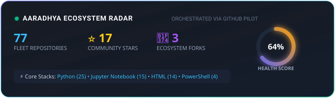

# Aaradhya Dev Tamrakar 🪐
### Computational R&D • Autonomous AI Systems • Systems Engineering

---

  

---

### 🛠️ Active Ecosystem & Production Repositories

| Repository | Tech Stack | Stars | Health | Focus & Architecture |
| :--- | :--- | :--- | :--- | :--- |
| **[brainstorm](https://github.com/Aaradhya-Dev-Tamrakar/brainstorm)** | `HTML` | ⭐ 2 | 🟡 55% | High-agency autonomous module |
| **[Gesture-Controlled-Self-Balancing-Robot](https://github.com/AaradhyaDT/Gesture-Controlled-Self-Balancing-Robot)** | `C++` | ⭐ 2 | 🟡 55% | High-agency autonomous module |
| **[crypto_arithmetic_solver](https://github.com/AaradhyaDT/crypto_arithmetic_solver)** | `Python` | ⭐ 2 | 🔴 25% | High-agency autonomous module |
| **[Aaradhya-Dev-Tamrakar-2.github.io](https://github.com/Aaradhya-Dev-Tamrakar/Aaradhya-Dev-Tamrakar-2.github.io)** | `HTML` | ⭐ 1 | 🟢 80% | Portfolio |
| **[stability-ai-system](https://github.com/AaradhyaDT/stability-ai-system)** | `Python` | ⭐ 1 | 🟡 70% | Edge AI Stability Detection System using RandomForest and FastAPI |
| **[BiasAperture](https://github.com/Aaradhya-Dev-Tamrakar/BiasAperture)** | `HTML` | ⭐ 1 | 🟡 55% | High-agency autonomous module |
| **[Claude-Desktop](https://github.com/Aaradhya-Dev-Tamrakar/Claude-Desktop)** | `HTML` | ⭐ 1 | 🟡 55% | High-agency autonomous module |
| **[nepali-ocr-ai](https://github.com/Aaradhya-Dev-Tamrakar/nepali-ocr-ai)** | `Python` | ⭐ 1 | 🟡 55% | High-agency autonomous module |

---

### 🌐 Multi-Account Fleet Topology
- **Organization Hub**: [github.com/Aaradhya-Dev-Tamrakar](https://github.com/Aaradhya-Dev-Tamrakar) *(Core Tool R&D, Microservices, CAD & Wearables)*
- **Personal Workspace**: [github.com/AaradhyaDT](https://github.com/AaradhyaDT) *(Web Mirrors, Sandboxes, Constraint Solvers)*

---
*Continuously monitored and auto-synthesized by [GitHub Pilot](https://github.com/Aaradhya-Dev-Tamrakar/github-pilot) via Token-Zero local scripts.*
